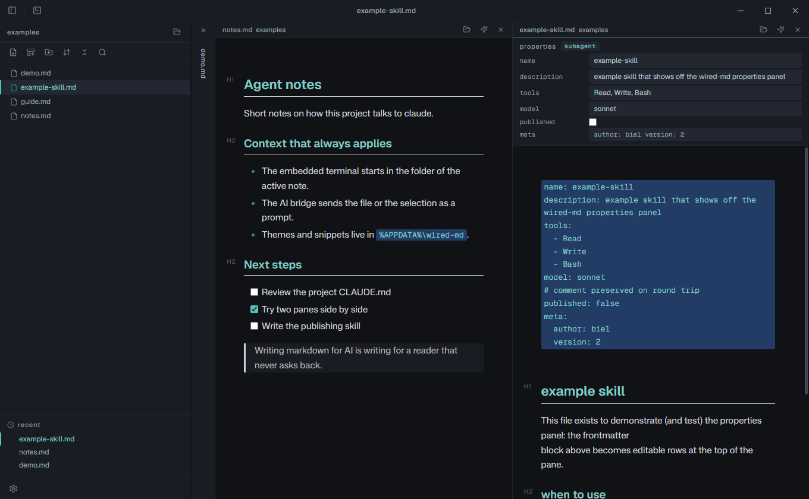

# wired-md

[](LICENSE)
[](#installation)
[](https://www.electronjs.org/)
[](https://claude.ai/)
[](https://buymeacoffee.com/gabrielsilvestri)

A desktop markdown editor for people who write markdown *for AI*: `CLAUDE.md` files, skills, prompts, agent notes. It renders inline as you type (Typora style, no split preview) and keeps everything as plain `.md` files in your folder, so your notes stay yours.

> The product name is not final yet. Until it is decided, the project uses its repository and package name, `wired-md`.



## Why

If you spend your day writing instructions for agents, a general note app gets in the way: it hides your files in a database, fights your `$297` price tags by turning them into math formulas, and has no idea what a `SKILL.md` frontmatter block is supposed to contain. wired-md is built around that exact workflow. It reads and writes ordinary markdown on disk, understands the schemas you actually write, and puts a bridge to `claude` one click away.

## Features

Everything below is implemented and covered by the end to end test suite.

- **Inline WYSIWYG editing (Typora style).** Markdown becomes the document as you type, no side by side preview pane. Powered by Vditor's instant rendering mode.
- **Tabs, and drag a tab to split.** Every open file is a tab: name, unsaved dot, a close button on hover, middle click to close, `Ctrl+W` for the active one. The bar scrolls sideways instead of wrapping, however many files you open. Drag a tab onto the left or right half of the editor and the view splits into side by side groups (three at most), each with its own tab bar and its own current file, separated by a resizer you drag: the widths are yours and survive a restart. Drop a tab on another group's bar to move it there, drag inside a bar to reorder, and an emptied group collapses and hands its width to the neighbour. Ctrl+click a file in the tree or in Recents to open it in the group beside.
- **The layout comes back.** The groups, their tabs, where each one was scrolled to and the file that was in front are remembered, so reopening the editor is not a blank slate. A file passed on the command line always wins over the saved session.
- **Obsidian style file tree.** The sidebar shows the folder of the open note (markdown only, `.claude` and the other agent folders included), refreshes itself when files change on disk, and has a Recents section. Header with the root folder name, the parent path under it (dimmed and truncated in the middle, full path in the tooltip) and a shortcut to Explorer; a toolbar for new file, new folder, sort, collapse all, and a filter box; a right click menu for rename, duplicate, export, copy path, and delete (always to the Recycle Bin, never a hard unlink). Resizable and hideable.
- **Command palette and quick switcher.** Ctrl+Shift+P for actions, Ctrl+P for files, both with fuzzy subsequence search. Enter runs or opens, Ctrl+Enter opens beside, Esc closes.
- **Full text search across the folder.** Ctrl+Shift+F searches file *contents* in every markdown file under the open note's folder, powered by a bundled ripgrep binary with a pure Node fallback. Grouped results with highlighted snippets, keyboard navigable.
- **Find and replace in the note.** Ctrl+F opens a compact search bar above the active note; Ctrl+H reveals replacement. Enter and Shift+Enter move between matches, with case and whole-word filters, one-match or replace-all actions, and undo/redo. Searches document text, including code and tables, while leaving Markdown syntax and link destinations intact. Escape closes the bar.
- **claude bridge, per note.** A sparkles button in each editor header opens the embedded terminal, brings up `claude`, runs `/cd` into the note's folder, and types the file path into the prompt *without sending it*, so you finish the question. The palette can send the current selection the same way. It never sends on its own: spending a token is your call.
- **Frontmatter as a properties panel.** A file that starts with a YAML `---` block gets an editable properties panel at the top of the pane: text fields for strings and numbers, comma separated fields for lists, checkboxes for booleans, and a read only box for anything the panel cannot represent (which is left untouched in the file). It validates against a schema chosen automatically (`skill`, `subagent`, a `.claude/commands` slash command, or generic), flagging a missing `name`, an empty `description`, a likely key typo, or an odd `model`, as a quiet inline warning, never a popup. The YAML block stays visible and the two views stay in sync both ways, preserving key order, comments, and nested maps on round trip.
- **Spreadsheet style table editing.** Tab moves to the next cell and grows the table when it runs off the last one, Shift+Tab goes back, Enter drops to the row below in the same column. A floating icon toolbar over the table (and a palette command for each) adds, deletes, moves and aligns rows and columns, so you never type a pipe. Every transform is applied to a single table node behind a round trip guard that verifies the rest of the document came back byte for byte identical before the change is kept.
- **Git state where the writing happens.** A letter badge (`M`, `A`, `?`, `D`, `R`) on each tree row and in the pane header, plus a read only diff view whose added and removed line colors are derived from the active theme and measured for contrast. Untracked files show as fully added. No staging and no commit UI: the embedded terminal already covers that. Outside a repository, or with no git on PATH, the feature is simply absent.
- **Template management from inside the app.** Create, rename, open for editing and delete templates (Recycle Bin, never a hard unlink) from the same picker that uses them.
- **New file from template, with variables.** Templates are `.md` files seeded into your user folder on first boot (skill, subagent, slash command, `CLAUDE.md`, and a dated note ship by default). Variables like `{{date}}`, `{{time}}`, `{{title}}`, `{{folder}}`, `{{cursor}}` (where the caret lands), and `{{ask:label}}` (asked once in an in app dialog) are filled in on creation. Cancel at any step and nothing is written.
- **Focus mode and typewriter mode.** Two independent toggles (F8 and F9). Focus dims every block except the one you are editing; typewriter keeps the current line vertically centered. The dim opacity is *measured*, not guessed, so faded text always clears the 4.5:1 contrast floor in whatever theme is active. Neither mode fights manual scrolling.
- **Themes and CSS snippets, Obsidian style.** Themes are `.css` files that define only the color variables; five ship by default (`wired`, `carbon` and `ash` dark, `light` and `parchment` light), living in `%APPDATA%\wired-md\themes\`. A settings panel edits any theme variable by hand and warns inline when a color you picked leaves the readable contrast band. Snippets are `.css` files you toggle on and off individually, layered over the theme. Accent color, document font, code font, and text size are live controls in the settings panel; everything persists to `%APPDATA%\wired-md\config.json`.
- **Studio typography, offline.** Geist, Geist Mono, Mona Sans, Inter, and Satoshi are bundled locally, no network needed. UI uses Geist, code and terminal use Geist Mono, document body defaults to Mona Sans.
- **Frameless window with a custom title bar.** Icon only chrome (no text menus), custom window controls, a draggable title bar, and window size, position, and maximized state persisted between sessions.
- **Open notes follow the disk.** When claude (or any other tool) rewrites a file you have open, a tab with no unsaved edits reloads in place, keeping your scroll position and focus. A tab you are editing shows an inline row to reload from disk or keep your version, so nothing is overwritten silently in either direction. A file deleted or renamed away keeps its tab open, and saving recreates it. Compare, or "what changed on disk" in the palette, shows exactly what claude changed.
- **A token estimate and an outline.** A status bar under the editor counts words, characters and approximate tokens (characters divided by four, honest about being an estimate), handy for keeping a `CLAUDE.md` or a `SKILL.md` small. The sidebar outlines the note's headings, follows the caret, jumps on click and tells you which section is the heavy one.
- **Nothing unsaved is lost.** Closing the window with unsaved tabs asks first (save all, don't save, cancel), and a crash is covered too: unsaved text is kept aside while you work and comes back as an unsaved tab at the next launch.
- **A right click menu in the text.** Cut, copy, paste and select all, the selection straight to your AI CLI, find in note, and open or copy a link under the pointer.
- **What a CLAUDE.md really costs.** Claude Code loads every `@path` a `CLAUDE.md` imports, four hops deep, so the status bar adds them up for `CLAUDE.md`, `CLAUDE.local.md` and `AGENTS.md`: every imported file and its token share in the tooltip, a broken import flagged, and Ctrl+click on an `@path` opens it.
- **Links go somewhere, images render.** Ctrl+click opens web links in the browser, other notes in a tab and `#headings` in place. Relative images render beside the note, and pasting or dropping an image saves it under `assets/` next to the note and links it. The window itself never navigates away.
- **A theme gallery and reading settings.** Ten more themes ship inside the app, each previewed from its own colors and kept between 4.5:1 and 11:1 contrast; install or switch with one click, nothing downloaded and no file overwritten. Line height and text width are live settings.
- **A first run welcome.** One screen to pick the AI CLI you call from the terminal (claude, codex, gemini, aider, opencode, cursor-agent, qwen or any command, each marked found on PATH or not), a theme with live preview and a document font. The palette brings it back, and the same CLI picker lives in Settings, terminal and AI.
- **Embedded terminal.** Ctrl+` opens a terminal in the current file's directory, resizable by dragging its top edge (height persisted). Backend is node-pty with a pipe based fallback if the native build is unavailable.
- **Dollar sign is money, not math.** Inline math is deliberately off, so `from R$297 to R$ 397` stays readable text instead of turning into an italic formula. Block math (`$$...$$`) still works.
- **Plain files, no lock in.** No database, no proprietary format. Everything is `.md` on disk, readable and editable by anything else.

## Installation

Windows 11, x64. No release is published yet: build the installer with `npm run dist` (see [Building the installer](#building-the-installer)) and run `dist\wired-md Setup <version>.exe`. It installs **per user**: no administrator prompt, nothing written under `Program Files`, and it registers `.md` and `.markdown` so the app appears in "Open with". Your notes, config, themes, snippets and templates live in `%APPDATA%\wired-md` and survive an uninstall.

The installer also adds its installation directory to your user PATH. New terminals can run `wired` without a separate Node.js or npm installation. Uninstall removes only the PATH entry created by wired-md and preserves entries owned by other software.

### From source

Requirements: Windows 11 and a recent Node.js.

```
git clone https://github.com/gabrielsilvestri/wired-md.git
cd wired-md
npm install
npm start
```

Open a file directly:

```
npx electron . path\to\file.md
```

There is also a portable Windows helper in `scripts/windows/` that creates a desktop shortcut and associates `.md` files with the app. See `scripts/windows/README.md`.

### Building the installer

```
npm run dist
```

electron-builder (config in [`electron-builder.yml`](electron-builder.yml)) produces `dist\wired-md Setup <version>.exe` plus an unpacked build in `dist\win-unpacked`. `scripts/smoke-installed.mjs` drives an *installed* build from outside over the DevTools protocol and checks the things only packaging can break: the window, the file from the command line, the `%APPDATA%` seeding out of `app.asar`, ripgrep running from `app.asar.unpacked`, and node-pty loading its prebuilt binary.

```
node scripts/smoke-installed.mjs "%LOCALAPPDATA%\Programs\wired-md\wired-md.exe"
```

## Keyboard shortcuts

- `Ctrl+N` new file, `Ctrl+O` open, `Ctrl+S` save, `Ctrl+Shift+S` save as.
- `Ctrl+P` quick switcher (files), `Ctrl+Shift+P` command palette (actions), `Ctrl+Shift+F` full text search. Enter opens or runs, `Ctrl+Enter` opens beside, `Esc` closes.
- `Ctrl+W` closes the active tab.
- `Ctrl+F` finds text in the current note; `Ctrl+H` opens replacement. `Enter` / `Shift+Enter` in the search field (or `F3` / `Shift+F3` with the bar open) go to the next / previous match. `Enter` in the replacement field replaces one match. `Esc` closes the bar.
- `Ctrl+click` a file in the tree or Recents to open it in the group beside the current one. `Ctrl+click` in the text follows a link, or an `@import` in a `CLAUDE.md`.
- `Ctrl+=` / `Ctrl+-` / `Ctrl+0` change document font size; `Ctrl+scroll` over the text also works.
- `Ctrl+\`` toggles the embedded terminal.
- `F8` focus mode, `F9` typewriter mode.

## CLI (experimental)

The editor can be driven from a terminal, so an AI agent working in a shell can put the right note in front of you. This is an experiment: the surface is small on purpose and may change.

```
npm link                                         # source checkouts only; the installer configures PATH itself

wired open <file>                                # open a .md (starts the editor if it is not running)
wired focus <file>                               # bring a file that is already open to the front
wired list [--json]                              # the files the editor has open
wired new [--template <name>] [--title <title>]  # create a note from a template and open it
```

There is no daemon, no server and no port: the app is single instance, and a second `wired` invocation hands its argv to the live window and exits. To CHANGE a note, write the file on disk with any tool: every open note follows its file, reloading in place when the human has no unsaved edits there and asking them to choose when they do. The CLI never sends content.

`skills/wired-md/SKILL.md` is a skill file that teaches an AI agent (Claude Code or any CLI agent) to use this.

In a source checkout, `npm link` runs the CLI with Node.js and finds Electron in `node_modules`. In an installed build, `wired.cmd` runs the CLI from `app.asar` through the bundled Electron runtime. The installed command does not require Node.js or npm on the user's PATH.

## Roadmap

- **A final name and icon.** The project still ships under its repository name.
- **Community themes.** The gallery installs the themes that ship with the app; themes contributed by others would join it the same way, measured by the same contrast gate.
- **A signed installer.** The per user installer builds today; code signing is still to do.

The full design rationale for the features that shipped lives in [`docs/pesquisa-features.md`](docs/pesquisa-features.md).

## Antifeatures

Things this editor will not grow, so nobody has to ask twice. This is an editor for the markdown you write *for* an AI, not a knowledge base.

- **No wikilinks and no backlinks.** `[[note]]` syntax, a backlinks panel and a graph view belong to Obsidian, which already does them well. A `CLAUDE.md` or a `SKILL.md` is read by a machine that has never heard of `[[note]]`.
- **No plugin system.** Themes and CSS snippets are files on disk and that is the whole extension surface.
- **No database and no proprietary format.** Plain `.md` files in your folders, always.
- **No cloud sync and no account.** Whatever syncs your folder syncs your notes.
- **No graph view.**

## Architecture

Electron main (`src/main/`, one file per IPC area) plus an ES module renderer (`src/renderer/modules/`, no bundler), with the YAML parser running in the preload and a bundled ripgrep binary for search. Third party browser assets are vendored into `src/renderer/vendor/` on install. The full architecture and the known traps are documented in [`CLAUDE.md`](CLAUDE.md).

## Testing

```
npm run smoke   # quick non interactive smoke test
npm run test:cli # focused CLI, PATH and unit checks
npm run test:crash # kill the app with unsaved edits, relaunch, expect them back
npm test        # full end to end suite (296 checks) plus a real crash and relaunch
```

See [`CONTRIBUTING.md`](CONTRIBUTING.md) for what these cover.

## Credits and license

wired-md is released under the [MIT License](LICENSE), copyright 2026 Gabriel Silvestri.

The bundled fonts (Geist, Mona Sans, Inter, Satoshi) are distributed under their own licenses, included in [`src/renderer/fonts/LICENSES`](src/renderer/fonts/LICENSES). Those licenses govern the font files regardless of the MIT license on this project's own code.

Built with [Claude](https://claude.ai/).
